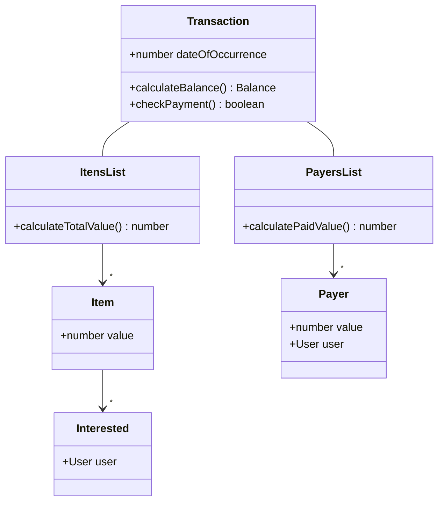

# rep-finances-app
Application that will be used for financial control between a group of people.

The application takes into account transactions, such as market purchases, residential accounts or cash loans, with the correct division between its items and related users, and shows a summary of the financial situation of each participant already registered, as well as the registered transactions.

Plans for the future of the app include a record with monthly notifications for residential accounts.

The application will be developed using Typescript, Node + Express, MongoDB, TDD and the S.O.L.I.D.

